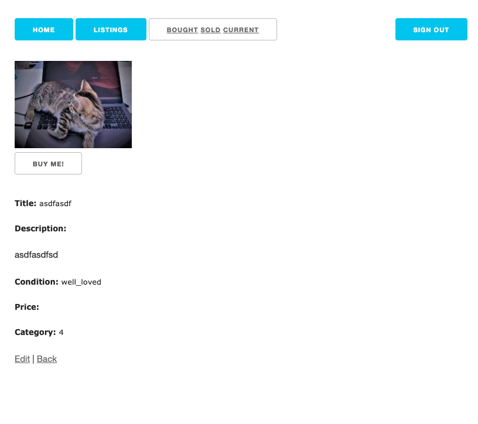
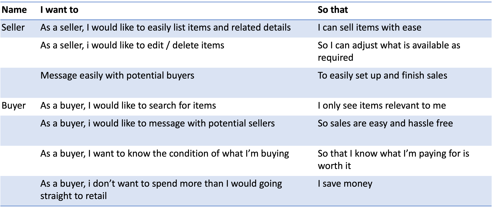

# README

Assignment submission for coder academy 2022, documentation requirements:

#Kittenkorner (R6-R10)
Kittens can take a lot of energy, time and money to raise into happy, healthy cats! Not only are they energetic furballs who require constant play, but they also grow out of things (sometimes very quickly) resulting in a lot of waste.

This app aims to fix this problem by creating a second hand marketplace for all things kittens grow out of! This includes:
* Harnesses, leads, collars
* Toys
* Beds/scratching posts
* Unopened food
* Litter (no used litter items!)
* Health treatments (flea, worm etc)
* Carriers and backpacks

There are a lot of petsitting websites, and general marketplace websites where cat items are sold, but based on some research there is not a specific app which targets this. There are groups on social media, but for those who aren’t on social media this provides an alternative.

Visit here: <https://kittenkorner.herokuapp.com/>; <https://github.com/jasminkang/KittenKorner>

##Functionality / Features (R11)
The purpose of kittenkorner is to provide very easy, greener and cheaper cat related exchanges with locals. It could also allow for local community building with fellow cat owners, enriching cat and human lives alike.

The app is very simple, users can list and item for sale or browse a listed item. Pages display basic historic info to the user. For privacy, contact details only available after the ‘purchase’ has been made. Would benefit from additional features, such as a wishlist, user messaging, and seller reviews.

Aimed at all cat and kitten caretakers, current or potential.

###Sitemap

###Screenshots

###Tech stack
front-end: HTML5, CSS, SCSS, Getskeleton
back-end: ruby on rails, postgresql

##User Stories (R12)

##Wireframes (R13)

##ERD (R14)

##High level components (R15)
Uses rails model of MVC:

Models: User, Listing, Category, Order
The main models are User (must exist for any other to exist), and then listings. All models ultimately inherit from ActiveRecord, a class in rails responsible for all database related operations. From ruby docs on activerecord: ActiveRecord represents models and their data, association between models, and inheritance hierarchies through related models.

Controllers: Listings, Pages, Orders.
Methods defined here are the brains and vision of the application. In listings, there are a number of CRUD methods as well as the 'place order' method (which creates an order for the listing). Controllers all inherit from Action controller, which already defines methods useful for the classes to inherit from in order for the application to run smoothly (and keeping code DRY).

Views: in this version of the app views are essentially different records of each listing type (bought, sold, current, shopping etc.). These pages all inherit from helper classes for consistency. They also inherit from Action View which has predefined methods to help render the views when a response is requested.

##Third party services (R16)
This app uses Heroku and devise

##Model relationships and associations (R17)

User: association and authorization with devise. Users have many listings, and orders through the listing. A user must exist for a listing to be posted.

Listings: for one listing, it belongs to a user, and is defined against a category.

Order: Created when a user ‘buys’ a listing. belongs to a single listing, and two users: a buyer (being the user id of the person who buys the item) and the seller (being the user who listed the items id).

Categories: Initialised with seed data to allow for listings to occur. One category for each listing, a listing belongs to a category.

##Database relations (R18)

User model: ultimate owner of all other models.
One user can set up multiple listings for sale OR just browse existing listings.

Listings model is other primary model. The methods for the other models exist here (category model, order model).

##Database scheme design (R19) <db/schema.rb>

##Project management (R20)
kept it too general because it was first time creating something on rails like this (end to end), have a better grasp for future what level of planning would actually be helpful, and how long tasks take for me to do when still new to coding.

Used a trello board - link here: <https://trello.com/b/yPtVf1Xc/marketplace-app>. The timings on the board were too ambitious, but items were completed within one or two days of the deadline. 

Although the product does not reflect all the features that would have been ideal, it is a basic functioning marketplace app.
